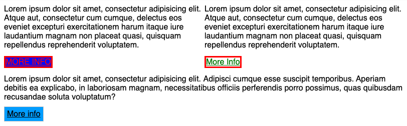

## Zadanie 1 - rozwiązywane z wykładowcą

Stwórz jeden **paragraf**, ustaw dla niego poniższe style i przetestuj ich działanie.

```css
p {
  font-size: 12px;
}

p {
  font-size: 40px;
}
```


## Zadanie 2

W arkuszu stylów, ustawione są style dla elementu o klasie `.more-info` oraz `.btn`, ale są one przesłonięte przez **specificity**.

Popraw selektory tak aby style zadziałały.

**Efekt końcowy:**




## Zadanie 3

Stwórz dwa **paragrafy** oraz jeden element **span** i wszystkim elementom ustaw tło w kolorze żółtym (```yellow```). Możesz to zrobić w dowolnie wybrany przez siebie sposób.


## Zadanie 4

Na stronie znajdują się 2 linki. Jeden na górze w formie tekstu, drugi na dole przypominający button. Button na dole ma błędny kolor tekstu (powinien być biały). Z czego to wynika? **Spróbuj naprawić ten problem**.

Dla tytułu w tekście zmień kolor na `#FC0031`.

