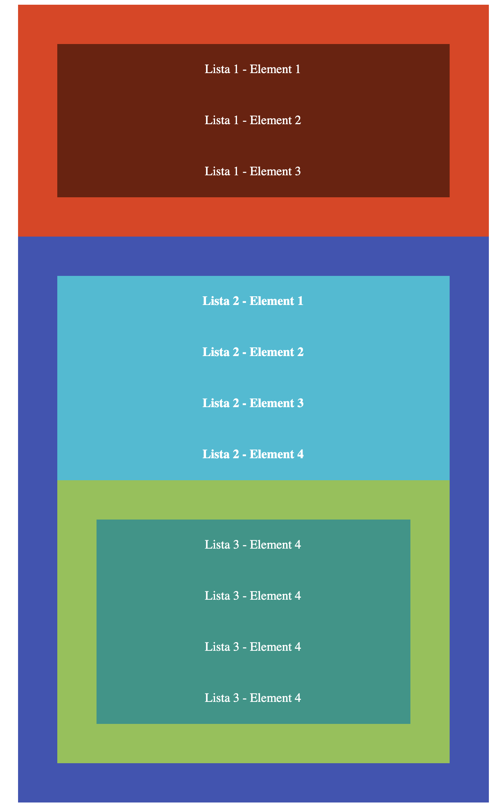

## Zadanie domowe

W pliku `index.html` znajduje się gotowy kod. 

**Nie należy zmieniać kodu HTML. Modyfikuj tylko kod CSS!**
 
 Ostyluj go według podanych wytycznych:

- Stwórz trzy zmienne globalne:
  - bazowy `padding` z wartością `50px`
  - bazowa wysokość linii `35px`
  - trzymającą jeden z kolorów `#8bc34a`
  
  
- Ustaw **wszystkim listom** odstęp wewnętrzny na `50px` korzystając z wcześniej zdeklarowanej zmiennej
- Dla każdego tekstu w każdym elemencie listy ustaw wysokość linii na ```50px``` (korzystając z wcześniej zdeklarowanej zmiennej i metody `calc`). Dodatkowo wyśrodkuj ten tekst,

- Pierwszej liście ustaw kolor tła `#e8370e` a jej elementom kolor tła `#711c08`,
- Drugiej liście ustaw kolor tła `#3f51b5` a jej elementom kolor tła `#00bcd4`,
- Trzeciej liście ustaw kolor tła na ten zapisany w zmiennej a jej elementom kolor tła `#009688`,

- Ustaw dla całego dokumentu biały kolor fonta,
- Pierwszej liście ustaw wagę fonta na `400`,
- Drugiej liście ustaw wagę fonta na `700`,
- Trzecia lista powinna mieć wagę fonta równą `400`,
- Wyłącz punktatory list.


Oczekiwany rezultat:

