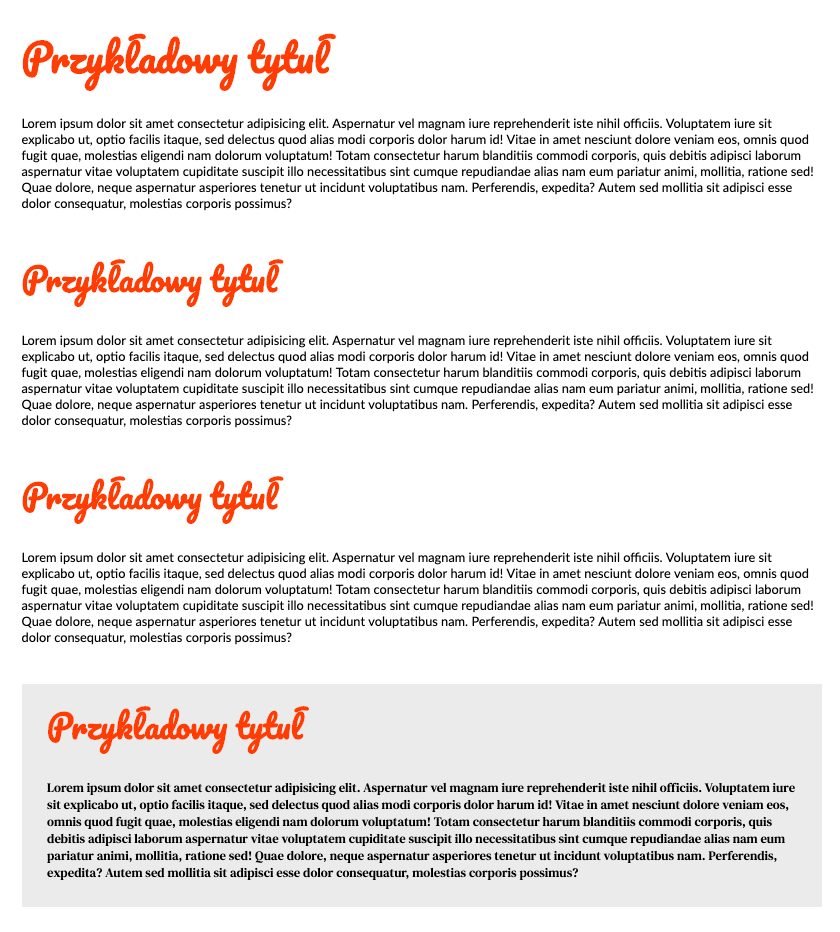

## Część 1 - Zadanie rozwiązywane z wykładowcą

- W katalogu `fonts` znajduje się plik `Lato-Regular.ttf`
- Na stronie [Font Squirrel](https://www.fontsquirrel.com/tools/webfont-generator) (wybierz opcję **Optimal** i zaznacz oświadczenie, że font został ściągnięty legalnie) lub [Transfonter](https://transfonter.org/) przejdź do generatora i załaduj do niego wyżej wymieniony font
- Po ściągnięciu zbioru na dysk rozpakuj archiwum
- Umieść w folderze `fonts` pliki z rozszerzeniem `woff` i `woff2` które znajdują się w rozpakowanym archiwum
- Stwórz w pliku `css/style.css` odpowiednią regułę `@font-face` (pamiętaj, że pliki z fontami znajdują się w folderze `fonts`)
- Dodaj wygenerowany font jako styl dla tekstów dla całej strony

---

## Część 2 - Zadanie do samodzielnego wykonania

Przejdź na stronę [Google Fonts](https://www.google.com/fonts) i wykonaj następujące czynności:

- korzystając z wyszukiwarki u góry wybierz font **Pacifico**
- wybierz styl „Regular 400” za pomocą przycisku „Select this style” na środku ekranu
- po prawej stronie pojawi się pasek boczny z wybranymi fontami
- skopiuj link i wstaw go do sekcji `head` strony
- za pomocą `font-family` dodaj ten font do tytułu wszystkich nagłówków (`h1` - `h2`)

---

## Część 3 - Zadanie do samodzielnego wykonania

- W katalogu `fonts` znajduje się plik `DMSerifText-Regular.ttf`
- Na stronie [Font Squirrel](https://www.fontsquirrel.com/tools/webfont-generator) (wybierz opcję **Optimal** i zaznacz oświadczenie, że font został ściągnięty legalnie) lub [Transfonter](https://transfonter.org/) przejdź do generatora i załaduj do niego wyżej wymieniony font
- Po ściągnięciu zbioru na dysk rozpakuj archiwum
- Umieść w folderze `fonts` pliki z rozszerzeniem `woff` i `woff2` które znajdują się w rozpakowanym archiwum
- Stwórz w pliku `css/style.css` odpowiednią regułę `@font-face` (pamiętaj, że pliki z fontami znajdują się w folderze `fonts`)
- Dodaj wygenerowany font jako styl dla **paragrafu w sekcji `.section--bottom`**

## Oczekiwany efekt końcowy

