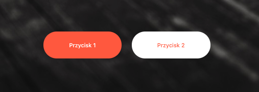

## Zadanie domowe - 1

W pliku HTML znajduje się przykładowy kod menu. Twoim zadaniem będzie takie jego ostylowanie, aby wyglądało jak na poniższej grafice:

Wytyczne dla menu:

- kolor tła menu to **#F15C5C**,
- menu ma krój "Pacifico" o wielkości **20px**. Font ten można pobrać z Google fonts.
- odstęp między elementami menu wynosi 20px
- odstęp wewnętrzny menu wynosi 20px
- menu nie powinno mieć odstępu zewnętrznego
- po najechaniu na link, zmienia się jego kolor na **#333**
- elementy ustaw obok siebie za pomocą `display: inline-block`

## Zadanie domowe - 2

W pliku `index.html` znajduje się prosty kod baneru. Twoim celem będzie takie jego ostylowanie by wyglądał jak na poniższej grafice:

Wytyczne dla baneru:
- wysokość `600px`,
- tło baneru to grafika leżąca w katalogu **images/car-background.jpg**,
- krój tekstu to **Oswald**, który można znaleźć na Google fonts.
- wielkość tekstu to `60px`, a grubość `600`
- kolor słowa "Sharing" `orangered`
- tekst ma być wycentrowany w obu osiach

Grafika tła po stworzeniu banera jest zbyt jasna, potrzebne jest jej przyciemnienie. Aby temu zaradzić dodaj dla banneru pseudoelement `::before`. Element taki powinien być pozycjonowany **absolutnie** i przykrywać całą powierzchnię baneru. Dodatkowo powinien mieć tło koloru **#111** i przezroczystość **0.5**.
Element taki przykryje tekst. Spróbuj tekst wynieść na wierzch.

## Zadanie domowe - 3

Na stronie znajdują się 2 przyciski. Twoim zadaniem będzie ostylowanie ich jak na poniższej grafice:
 

Wytyczne do stylowania:

- przyciski nie powinny mieć obramowania,
- przyciski powinny mieć kursor łapkę,
- odstęp wewnętrzny przycisków wynosi `20px` z góry i dołu oraz `50px` z lewej i prawej strony,
- zaokrąglenie rogów to `35px`,
- czerwony kolor użyty w przyciskach to **tomato**
- odstęp między przyciskami powinien wynosić minimum **10px**
