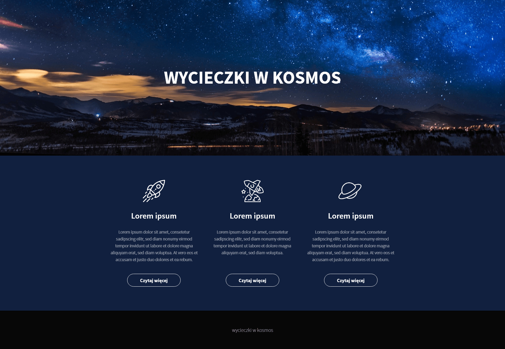
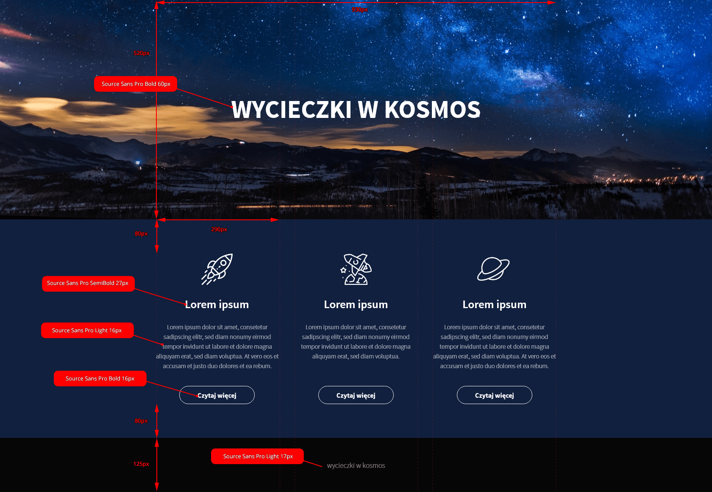

## Zadanie 1 - rozwiązywane z wykładowcą

### Treść do tego zadania, znajduje się w poprzedniej prezentacji!

## Zadanie 2

Poniżej masz widok layoutu, który masz do przygotowania:

Poniższa grafika pokazuje pomocne informacje dotyczące projektu:

**Informacje o layoucie:**

- W projekcie użyty jest Source Sans Pro, który możesz znaleźć na [Google Fonts](https://fonts.google.com/specimen/Source+Sans+Pro)
- Tło strony zajmuje pełną szerokość, natomiast szerokość treści to `930px`
- Ikony nad tekstami i grafika użyta w banerze, znajdują się w katalogu `images`
- Kolor tła strony to `#11203E`
