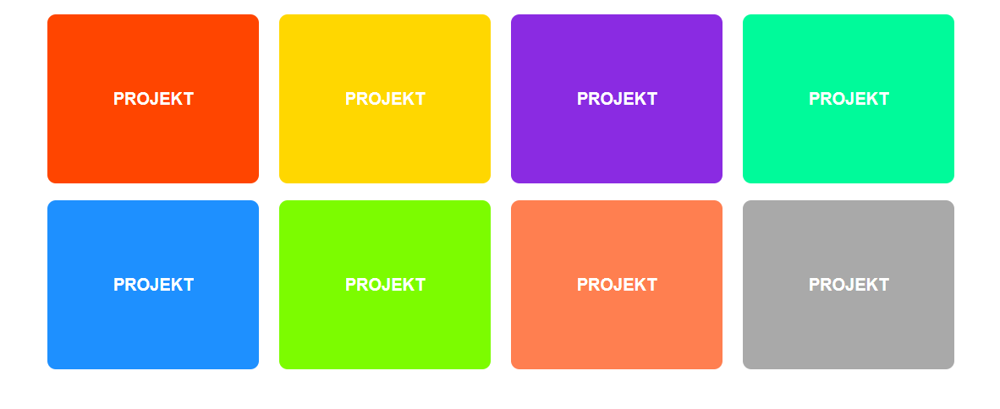

## Zadanie domowe - Kolorowe kafelki

W pliku `index.html` znajduje się przykładowy kod mini galerii z projektami. 
Twoim celem będzie nadanie jej wyglądu jak na poniższej grafice:



Wytyczne do zadania:
- elementy mają wymiary `250x200`,
- elementy mają zaokrąglenie narożników o wielkości `10px`
- tekst w elementach pisany jest krojem `sans-serif` o wielkości `20px` i kolorze białym.
- jeżeli mają na tyle miejsca, powinny wyświetlić się obok siebie. Jeżeli będziemy zmniejszać okno przeglądarki, powinny spadać do kolejnych rzędów

Kolory kolejnych elementów to:
- orangered
- gold
- blueviolet
- mediumspringgreen
- dodgerblue
- lawngreen
- coral
- darkgray


## Flexbox Defense

Ukończ grę Flexbox Defense do której link znajdziesz tutaj: [http://www.flexboxdefense.com/](http://www.flexboxdefense.com/).


## Zadanie domowe

Stwórz stronę jak na załączonym obrazku:


* Zacznij od zresetowania wszystkich właściwości CSS zależnych od przeglądarki (prosty reset wystarczy).
* Dołącz do strony font [Bungee Inline](https://fonts.google.com/specimen/Bungee+Inline). Podłącz rodzinę czcionek bezpośrednio z Google Fonts.
* Do body dodaj 3 elementy:
    * ```header```
    * ```section```
    * ```footer```
* Stwórz klasę __container__. Ustaw jej szerokość ```800px``` i spraw, żeby zawsze była wyśrodkowana w poziomie.
* Ustaw elementowi ```header``` szerokość ```100%``` oraz wysokość ```700px``` i użyj pliku __concert.jpg__ z katalogu __images__ jako tła.
* Niech tło w elemencie ```header``` zawsze będzie wyśrodkowane i zawsze odpowiednio rozciągnięte aby pokryć cały element (użyj odpowiednich wartości przy właściwościach ```background-size``` i ```background-position```).
* Wewnątrz elementu ```header``` umieść tekst (wykorzystaj odpowiedni semantyczny element), wyśrodkuj go w pionie i poziomie względem rodzica i nadaj mu odpowiednie właściwości:
    * waga czcionki na ```700```,
    * wielkość czcionki na ```50px```,
    * kolor ustaw na ```#FFFFFF```
* Ustaw elementowi ```section``` szerokość ```100%``` i kolor tła ```#FFFFFF```.
* W pliku __text.txt__ jest tekst, jaki należy umieścić wewnątrz elementu ```section```.
* Pamiętaj, że tekst w elemencie ```section``` musi zostać ograniczony przez odpowiedni element z klasą __container__.
* Odsuń tekst od góry i od dołu o ```100px``` i nadaj mu odpowiednie właściwości:
    * waga czcionki ```400```,
    * wielkość czcionki ```22px```,
    * wysokość linii ```26px```
* Ustaw elementowi ```footer``` szerokość ```100%``` i wysokość ```200px``` oraz kolor tła ```#000000```.
* Tekst w elemencie ```footer``` jest wyśrodkowany w pionie i przesunięty maksymalnie w prawo (pamiętaj, że jest ograniczony przez element z klasą __container__).
* Tekst w elemencie ```footer``` ma następujące właściwości:
    * waga czcionki ```400```,
    * wielkość czcionki ```20px```,
    * kolor czcionki ```#FFFFFF```.
