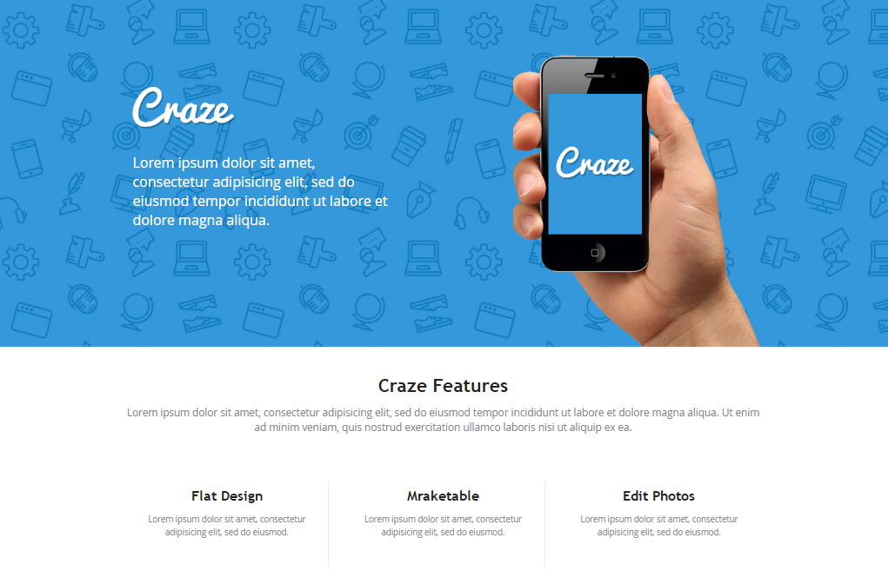

## Stwórz stronę na podstawie poniższych wytycznych:

## Wytyczne dotyczące projektu
* Font użyty w projekcie to `Open Sans` (wygeneruj odpowiednie pliki z FontSquirel i dodaj do projektu).
* Wszystkie potrzebne obrazki są wycięte i umieszczone w katalogu `images`.
* Szerokość strony `930px` (środek strony, a nie całość).
* Wielkości i kolory fontu:
  * **tekst w headerze**: `24px`, `white`,
  * **tekst w contencie**:
    * nagłówek („Craze Features”): `30px`, `#232323`,  
    * tekst (niżej): `18px`, `#838383`,
  * **tekst w trzech boksach**:
    * nagłówek: `24px`, `#232323`,
    * tekst: `16px`, `#838383`.

##Potrzebujesz pomocy?
* [FontSquirel - Open Sans](http://www.fontsquirrel.com/fonts/open-sans)
